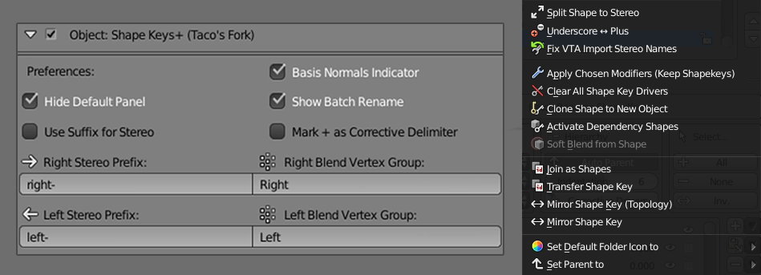

Shape Keys+ (Taco's Fork)
===========
###### Shape Keys Plus Custom

A modified version of Michael Glen Montague's [Blender](https://www.blender.org/) add-on [Shape Keys+](https://github.com/MichaelGlenMontague/shape_keys_plus) with an expanded feature set.

Currently only Blender 2.79 compatible, the goal of this repository is to eventually update my fork to the modern Blender api. Documentation and download links will come after some progress has been made.

<pre>                    </pre>

